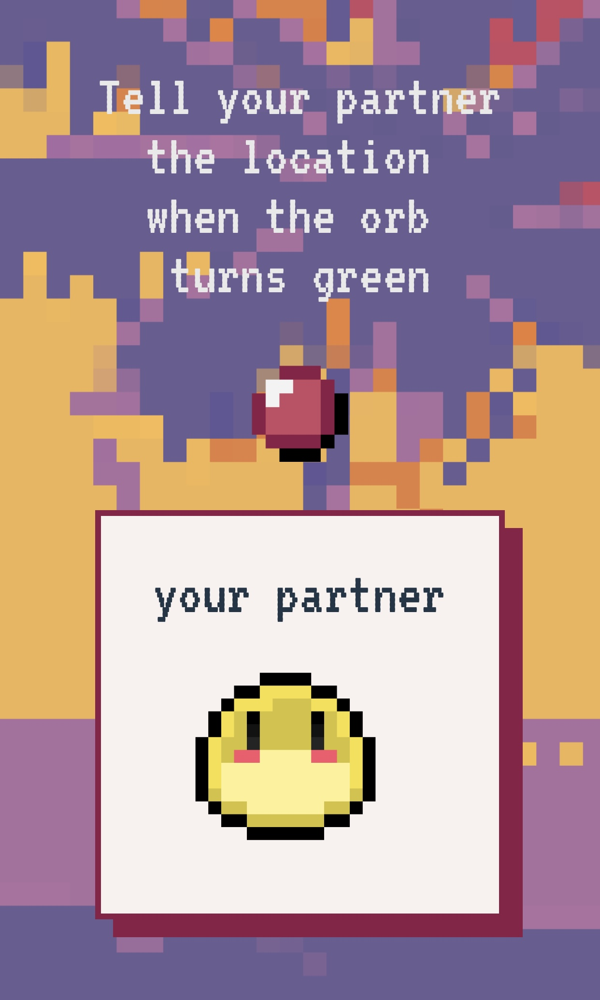

# Final Group Project

| **Student ID** | **Name**            | **Email**             |
| :------------- | :------------------ | :-------------------- |
| 20190656       | Seungyeon Choi      | nsy033@kaist.ac.kr    |
| 20200877       | Siripon Sutthiwanna | siripon_s@kaist.ac.kr |
| 20236043       | Atish Waghwase      | atish@kaist.ac.kr     |

---

## Contents
- [Final Group Project](#final-group-project)
  - [Contents](#contents)
  - [Links](#links)
  - [Description](#description)
    - [Project Topic](#project-topic)
    - [Narratives](#narratives)
    - [Representative Screenshots](#representative-screenshots)
      - [TV Client](#tv-client)
      - [Mobile Client](#mobile-client)
    - [Components](#components)
    - [Rule and Interface](#rule-and-interface)
  - [Code Organization](#code-organization)
    - [Socket.io](#socketio)
    - [Design Patterns](#design-patterns)
  - [Issues](#issues)
  - [Resources](#resources)
  
---

## Links
- Github Repository
  - Front-end: https://github.com/IDislikeChair/id311-blob-frontend
  - Back-end: https://github.com/IDislikeChair/id311-blob-backend
- Deployed link
  - Front-end: https://idislikechair.github.io/id311-blob-frontend
  - Back-end: https://blob-backend.herokuapp.com
- Video
  - Youtube: TODO

---

## Description

### Project Topic
- Our team wanted to develop a party game that would gather up people together with just mobile and TV without any additional other hardware devices. The name of our game is *Blob Island*.
  
### Narratives
- 6 blobs compete for survival. They live in a pixelated island. Beating their rivals, they run towards the boats, pick the lock of cabinets to get a reward, and point a gun at yesterday's friend's weakness in the dark. They continue to try to be the final survivors anyway, but eventually, only one blob wins the pixelated triumph.
  
### Representative Screenshots
#### TV Client
|  |  |
| :-------------------------------------------------------------- | :-------------------------------------------------------------- |
|  |  |
|  |  |

#### Mobile Client
|  |  |       |
| :--------------------------------------------------------------------- | :--------------------------------------------------------------------- | :-------------------------------------------------------------------------- |
|  |  |  |

### Components

|  |  |  |  |  |  |  |  |
| :-------------------------------------------------------------: | :--------------------------------------------: | :--------------------------------------------------: | :----------------------------------------------------: | :-----------------------------------------------------: | :--------------------------------------------------: | :------------------------------------------------------: | :--------------------------------------------------: |
|                         Sprites of Blob                         |                      Boat                      |                       Cabinet                        |                         Locks                          |                         Hearts                          |                         Guns                         |                          Lights                          |                         Orbs                         |

### Rule and Interface
- This party game basically encourages more than 6 people to gather in one room and enjoy the game together. A party room requires 1 TV 6 six mobiles (Android or iPhone) to be prepared. TV is the role of a party host, which displays the overall flow of the game and the progress of the current players. Players participate in the game by using their mobile devices.
- The game consists of a total of 3 stages, and the number of survivors is reduced in the order of 6 - 4 - 2 - 1. The player who survives to the end wins.
- Once the TV host generates a party room number, players can enter the room number and their nickname on their mobile and then can join the game. After all the players have joined, the game starts when the TV host clicks the Start Game button on the screen.
- Stage 1: Reaching the Boat
    - 6 players start simultaneously at the starting line and run toward the boat, the finish line.They can run by **alternately tapping** their mobile phone screens. The faster they alternately tap, the faster they can run.
    - Two players will be eliminated as a result for this stage.

|  |  |
| :-------------------------------------------------------------- | :--------------------------------------------------------------------- |
| a) TV screen for stage 1                                        | b) Mobile screen for players                                           |

  - Stage 2: Finding Supplies
    - Pairs are formed in the order which they arrive at the boat on the previous stage. For each pair, one of the two should be a solver and the other should be a guider, and a total of three locks are given to be unlocked.
    - Solver **tilts** his phone from side to side, on x-axis. This mobile tilting is represented with the lock icon on the TV screen moving from side to side.
    - There is only one position where each lock can be picked. If this tilting action actually makes the lock to reach the correct position, the color of the orb located on the guider's screen will change from red to green.
    - When the guider notifies the solver to pick the lock when he sees the green signal, the solver tries to pick the lock by **tapping** his screen once.
      - If this tapping is done in the correct position, the lock is released.
      - If this tapping is done in the wrong position, the lives given to this pair will disappear by one. Initially, the game starts with 5 lives for each pair.
    - Stage 2 ends with their defeat if any pair exhausts all of their lives, or their victory if they release all of the given locks. As a result, one of the pair, i.e. two players are eliminated.

|  |  |  |
| :-------------------------------------------------------------- | :--------------------------------------------------------------------- | :--------------------------------------------------------------------- |
| a) TV screen for stage 2                                        | b) Mobile screen for solver                                            | c) Mobile screen for guider                                            |

  - Stage 3: Hunt in the Darkness
    - Only two players who survive from stage 2 can advance to stage 3. Here, players **tilt** their phones left and right or up and down, on x-axis and y-axis, to adjust the position of the flashlight displayed on the TV screen, or shoot by **tapping** the mobile screen once.
    - Players can only see the shape of the opponent's character where the flashlight is not reached. When a player moves his flashlight with tilting, he can finds the randomly appearing target hidden in the dark, i.e. the opponent's weaknesses.
    - Only when this target is within the flashlight range, the player can shoot at this target which can damage the opponent.
    - Each player has three lives, and if one player loses all of them, the stage ends. The last player who survived to the end will be the final winner of this game.

|  |  |
| :-------------------------------------------------------------- | :--------------------------------------------------------------------- |
| a) TV screen for stage 3                                        | b) Mobile screen for players                                           |

## Code Organization

### Socket.io
- We used Socket.io to allow clients and the server to send and receive messages.
- We have 11 different states (`START, PRE_MISSION_1, MISSION_1, POST_MISSION_1, PRE_MISSION_2, ...`), which is defined in back-end side.
  - If the server sends a message to start the Nth state to the client, then the front-end side will receive this message and start the according scene.
  - e.g. Most of messaging is done such like the way below.
  >  1. Server knows that `PRE_MISSION_1` is ended.
  >  2. Inside of server, *gameFlowMgr* executes *on_next()* function.
  >  3. Its state changes from `PRE_MISSION_1` to `MISSION_1`.
  >  4. Server executes *start_mission(1)* which sends message to both TV and mobile client to start mission 1.
  >  5. App.svelte in front-end, receives the message to start mission 1.
  >  6. According to their role (0 for TV and 1 for mobile), they change their scene.

### Design Patterns

**MVC**

- The blob characters or the components like locks or handlights are moving according to the user action, which is transmitted through the server. As we have learned in class, it could lead to jittering or some kind of side effects if the event handling and rendering of the screen are not distinguished properly.
- Therefore, we have adopted an approach that separates the model, view, and controller. So, for most of the front-end side implementations, we have tried to separate the drawing and each algorithmic parts about controlling data.

**Singleton**

- In the back-end side, there is only one *SocketMgr*, as there is no need for the Socket Managerto be constructed repeatedly and it should not be. Rather it would be good to only generated at the very first time and use that instance again from the next needs. Therefore, we have tried to utilize the Singleton design pattern in this way.

**Factory**
- In *GameFlowMgr* of the back-end side, there is a *get_mission()* function that generates each mission, object, which means the stage, serving as a factory. This function takes only *missionId* as a parameter, processes internally which mission object the caller needed, and creates a new mission object through *new* to return it.

**Abstract class and Inheritance**
- In the back-end side, each mission class has common attributes such as *gameFlowMgr* and *playerMgr*, and also has the common *wrap_up()* function that performs tasks such as organizing the final survivor while finishing each mission.
- Therefore, after defining the *AbstractMission* class, which is a class that abstracts the characteristics of these missions, each of Mission 1, 2, and 3 inherits this *AbstractMission* and is implemented using a method of appropriately overwriting the *wrap_up()* function to suit each situation.

---

## Issues
- The current game is designed to be played by 6 players, but in fact, the TV host can start the game even if there are not exactly 6 players who joined.
  - If the game started with fewer than 6 players, random bots appear as dummies. They don't do anything, but they just stay still.
  - Even if more than six players try to join, it is not blocked. On the TV host screen, only 6 players who accessed first appear, and no characters appear on the mobile screen from the 7th.
- If a mobile client loses connection during the game due to network issues or other issues, he cannot join and continue the game again. When a player goes out in the middle of the game, he will be shown as undefined, not displaying any character there.
  - We gave each player a number from 0 to 5, and if there is an absence of any player, there is also the possibility of additional errors from the way this number is indexed.

## Resources
- [Blob sprites](https://www.artstation.com/artwork/9N2ZQQ)
- [Generating TTS](https://beta.elevenlabs.io)
- [Accessing the accelerometer sensor](https://kongmunist.medium.com/accessing-the-iphone-accelerometer-with-javascript-in-ios-14-and-13-e146d18bb175)